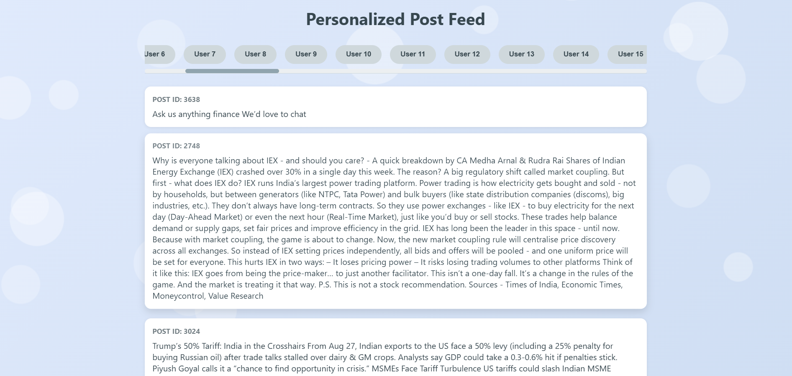

# 🔎 Post_Recommendation



[](https://www.python.org/)
[](https://flask.palletsprojects.com/)
[](https://pandas.pydata.org/)
[](https://scikit-learn.org/)


A lightweight, explainable hybrid recommendation engine that ranks posts for each user by blending content relevance, social proof, and recency. This README is short, actionable, and visually rich — icons and emojis added to make scanning easier. ✨

---

Table of contents
- Project snapshot 📌
- What it does (short) 🧠
- Tech stack & badges 🛠️
- Project layout 🗂️
- Core pipeline (concise) ⚙️
- Configuration & tunables 🔧
- API example 📡
- Quickstart 🚀
- Experiments & best practices 🔬
- Privacy & data notes 🔒
- Roadmap & contributing 🌱

---

Project snapshot 📌
- Purpose: For a given user, return a ranked list of posts most likely to interest them using a weighted mix of semantic similarity, popularity, and recency.
- Output: JSON endpoint with posts, users, and recommendations; single-page frontend that consumes it and renders recommendations instantly. ⚡

What it does (short) 🧠
- Builds per-user recommendations by combining:
  - Content relevance (TF–IDF + cosine similarity) 📝
  - Popularity (likes + shares, normalized) 👍
  - Recency (time-decay freshness) ⏳
- Provides explainability hooks (per-signal scores available if enabled).

---

Tech stack & badges 🛠️

- Backend
  - 🐍 Python 3.8+ — core language
  - 🌶 Flask — tiny web server & API (templates served from /templates)
  - 📦 requirements.txt — lists exact package versions

- Data & ML
  - 🗃 pandas — CSV loading, cleaning, transforms
  - 🔢 numpy — numeric ops and normalization
  - 🧠 scikit-learn — TF–IDF vectorizer, cosine similarity, preprocessing utilities
  - ⚖️ imbalanced-learn (optional) — sampling tools if you add engagement imbalance handling

- Frontend
  - 🌐 HTML / CSS / JavaScript — templates/index.html for demo UI (client-side rendering of recommendations)
  - 🖼 Optional avatars / thumbnails you add to `assets/` for richer UI

- Optional / Advanced (drop-in)
  - 🔗 SentenceTransformers / Hugging Face Transformers — for dense semantic embeddings (upgrade path)
  - 🗄 SQLite or Redis — persist recommendations or cache TF–IDF matrices
  - 🧾 joblib / pickle — save precomputed TF–IDF models & matrices

- Dev & infra
  - 🧪 pytest — unit tests for scoring functions (recommended)
  - 🐳 Docker (optional) — reproducible deployment
  - 🧰 Git & GitHub — version control & collaboration

Badges / quick links
- Python: https://www.python.org/
- Flask docs: https://flask.palletsprojects.com/
- pandas: https://pandas.pydata.org/
- scikit-learn: https://scikit-learn.org/

Short rationale: the stack is intentionally minimal so you can run everything locally with CSV files and a virtualenv — no heavy infra required. If you want deeper semantic matching later, switch TF–IDF for transformer embeddings with minimal API changes.

---

Project layout 🗂️
```
Post_Recommendation/
├── app.py                       # Flask app + API endpoints
├── recommendation.py            # Core feature engineering & scoring
├── templates/
│   └── index.html               # Frontend demo (loads /api/data)
├── posts.csv
├── posts_clean.csv
├── users.csv
├── users_clean.csv
├── ecommendations_final_semantic.csv
├── Post_rec.png
├── requirements.txt
└── README.md
```

Core pipeline (concise) ⚙️
1. Load & clean
   - Read CSVs, normalize column names, strip noise, store cleaned CSVs.
2. Profile & featurize
   - User profile: parse `interested_in` → keywords; or aggregate liked-post vectors.
   - Post profile:
     - Semantic: TF–IDF vectors on content.
     - Popularity: likes + α·shares → log/clip → normalize.
     - Recency: age → exponential decay.
3. Score
   - semantic_score = cosine(user_vec, post_vec) ∈ [0,1]
   - popularity_score, recency_score ∈ [0,1]
4. Combine & rank
   - final_score = w_s*semantic + w_p*popularity + w_r*recency
   - Output per-user ordered post IDs
5. Serve
   - GET /api/data → returns posts, users, recommendations mapping (one request → everything)

Key configuration & tunables 🔧
- Weights (recommendation.py):
```python
SEMANTIC_WEIGHT = 0.6
POPULARITY_WEIGHT = 0.25
RECENCY_WEIGHT = 0.15
```
- TF–IDF: max_features, ngram_range, stop_words
- Popularity: linear | log1p | percentile clipping
- Recency: exponential decay λ → controls half-life (days)

API example 📡
- GET /api/data returns:
```json
{
  "posts": [
    {"post_id":"101","text":"Startup fundraising 101","created_at":"2025-09-20","likes":120,"shares":10},
    ...
  ],
  "users": [
    {"user_id":"5","name":"Casey","interested_in":["startups","investing"]},
    ...
  ],
  "recommendations": {
    "5": [101, 203, 45, ...],
    "2": [87, 101, 11, ...]
  }
}
```
Optional: add /api/recommendations/<user_id> or include per-post score breakdown if you want explainable UI badges.

Quickstart — run locally 🚀
1. Clone & create env
```bash
git clone https://github.com/EniyanA2113/Post_Recommendation.git
cd Post_Recommendation
python -m venv venv
# macOS / Linux
source venv/bin/activate
# Windows
# venv\Scripts\activate
pip install -r requirements.txt
```
2. Start server
```bash
python app.py
```
3. Open in browser
- UI: http://127.0.0.1:5000/
- API: http://127.0.0.1:5000/api/data

Experiments & best practices 🔬
- Tuning weights: run small A/B tests with different weight configs; log click/engagement.
- Memory: reduce TF–IDF max_features or cache TF–IDF matrix to disk (pickle) for faster restarts.
- Popularity smoothing: log-scaling or percentile capping prevents viral posts from dominating.
- Upgrade semantic layer: try SentenceTransformers for dense embeddings if you need better semantics.

UI enhancements & icons 🎨
- index.html already renders cards — consider:
  - Score badges with emojis: 🔥 (popularity), 🧭 (semantic), ⏱️ (recency)
  - Small author avatar icons + post thumbnails
  - Tag chips (hashtags) and filter icons for quick faceted search

Privacy & data notes 🔒
- Do not commit PII. Clean or anonymize CSVs before public sharing.
- Validate CSV schema on load and sanitize text fields to avoid injection in templates.

Roadmap & contributing 🌱
- Add GET /api/recommendations/<user_id> and per-post score breakdown
- Persist recommendations in SQLite for instant startup
- Add pytest unit tests for scoring functions
- Swap TF–IDF for Transformer embeddings option
To contribute: fork → feature branch → PR. Small CSV fixtures help testing.


Made with ❤️ by @EniyanA2113 
